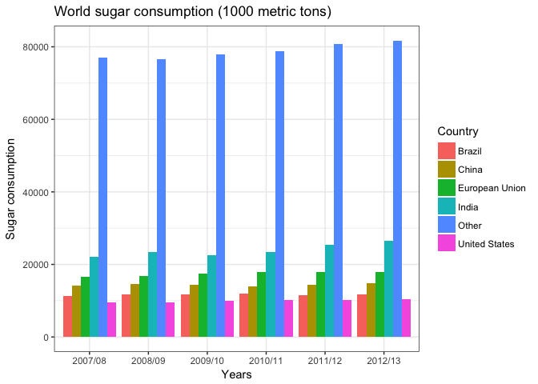

First try webscrapping
================

Objective
=========

The objective of the current project is to learning scraping html table from Wikipedia

Source of data
==============

<https://en.wikipedia.org/wiki/Sugar#Consumption>

``` r
#loading libraries
library(rvest)
library(ggplot2)
library(dplyr)
library(scales)
library(maps)
library(magrittr)
library(reshape2)
library(varhandle)

#set up the data
url <- "https://en.wikipedia.org/wiki/Sugar#Consumption"
sugar <- read_html(url)
sugar %<>%
  html_nodes(xpath = '//*[@id="mw-content-text"]/div/table[2]') %>%
  .[[1]] %>%
  html_table(fill = T)
str(sugar)
DT::datatable(sugar)
```

``` r
#data processing
#remember the names
n <- sugar$Country

# transpose all but the first column (name)
sugar <- as.data.frame(t(sugar[,-1]))
colnames(sugar) <- n
```

Data was processing outside using Excel and reload it into R.

``` r
sugar1 <- read.csv("~/Desktop/learning/Wechat/sugar.csv", stringsAsFactors=FALSE)
sugar1
```

    ##       Date Total        Country
    ## 1  2007/08 22021          India
    ## 2  2008/09 23500          India
    ## 3  2009/10 22500          India
    ## 4  2010/11 23500          India
    ## 5  2011/12 25500          India
    ## 6  2012/13 26500          India
    ## 7  2007/08 16496 European Union
    ## 8  2008/09 16760 European Union
    ## 9  2009/10 17400 European Union
    ## 10 2010/11 17800 European Union
    ## 11 2011/12 17800 European Union
    ## 12 2012/13 17800 European Union
    ## 13 2007/08 14250          China
    ## 14 2008/09 14500          China
    ## 15 2009/10 14300          China
    ## 16 2010/11 14000          China
    ## 17 2011/12 14400          China
    ## 18 2012/13 14900          China
    ## 19 2007/08 11400         Brazil
    ## 20 2008/09 11650         Brazil
    ## 21 2009/10 11800         Brazil
    ## 22 2010/11 12000         Brazil
    ## 23 2011/12 11500         Brazil
    ## 24 2012/13 11700         Brazil
    ## 25 2007/08  9590  United States
    ## 26 2008/09  9473  United States
    ## 27 2009/10  9861  United States
    ## 28 2010/11 10086  United States
    ## 29 2011/12 10251  United States
    ## 30 2012/13 10364  United States
    ## 31 2007/08 77098          Other
    ## 32 2008/09 76604          Other
    ## 33 2009/10 77915          Other
    ## 34 2010/11 78717          Other
    ## 35 2011/12 80751          Other
    ## 36 2012/13 81750          Other

``` r
sugar1$Country <- as.factor(sugar1$Country)
str(sugar1)
```

    ## 'data.frame':    36 obs. of  3 variables:
    ##  $ Date   : chr  "2007/08" "2008/09" "2009/10" "2010/11" ...
    ##  $ Total  : int  22021 23500 22500 23500 25500 26500 16496 16760 17400 17800 ...
    ##  $ Country: Factor w/ 6 levels "Brazil","China",..: 4 4 4 4 4 4 3 3 3 3 ...

``` r
#visualise the data
ggplot(sugar1, aes(x = Date, y = Total, fill= Country)) + 
  geom_bar(stat = "identity", position = 'dodge') + labs(title = "World sugar consumption (1000 metric tons)", x = "Years", y = "Sugar consumption") + 
  theme_bw()
```


